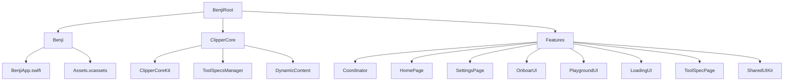

# Benji iOS Application

Benji is an on-device AI application designed to deliver contextual intelligence while ensuring user privacy. Users can select their preferred AI model, and Benji offers tool calling capabilities to leverage online resources for summarizing search results, weather updates, agendas, and more. Please note that Benji is currently a work in progress.

## Compatibility

- **iOS Version**: Requires iOS 17.0 or later (iOS 18.0+ for certain features)
- **Devices**: Compatible with iPhone and iPad devices running iOS 17.0+
- **Swift Version**: Built with Swift 6.0
- **Xcode**: Requires Xcode 15.0 or later

## App Architecture

Benji is architected as a modular iOS application with the following design principles:



### Modular Design
- **Swift Package Manager (SPM)**: The application is organized into modular packages:
  - **ClipperCore**: Core AI functionality, model management, and tool specifications
  - **Features**: UI components and feature modules (HomePage, SettingsPage, OnboardUI, etc.)
- **Protocol-Oriented Programming**: Extensive use of protocols for abstraction and testability
- **Coordinator Pattern**: Navigation and view coordination managed through a centralized coordinator service

### Architecture Patterns
- **SwiftUI**: Declarative UI framework for building responsive and modern interfaces
- **Swift Concurrency**: Strict Swift Concurrency (`SWIFT_STRICT_CONCURRENCY = complete`) with `async/await` for all asynchronous operations
- **Environment-Based Dependency Injection**: Services provided through SwiftUI environment values
- **Observable Pattern**: Uses `@Observable` for state management and reactive UI updates

### Code Organization
- **Separation of Concerns**: Clear separation between UI, business logic, and data layers
- **Feature Modules**: Each major feature (HomePage, SettingsPage, PlaygroundUI, etc.) is a self-contained module
- **Shared Components**: Common UI components and utilities in SharedUIKit module

## Frameworks

Benji leverages the following frameworks and technologies:

### Core Technologies
- **Swift 6.0**: Built with Swift 6.0, ensuring compatibility with the latest language features, strict concurrency checking, and improved type safety
- **SwiftUI**: For constructing the user interface in a declarative manner
- **Swift Concurrency**: Comprehensive use of `async/await`, `Task`, and actors for concurrent operations

### AI & Machine Learning
- **MLX Swift LM**: On-device language model execution using Apple's MLX framework
- **CoreML**: Utilized for on-device machine learning capabilities, ensuring that AI interactions and data processing occur locally to maintain user privacy

### Additional Frameworks
- **Combine**: Employed for handling asynchronous events and data streams where appropriate
- **MarkdownUI**: For rendering markdown content in chat responses
- **SwiftLint**: Code quality and style enforcement

### Tool Calling System
- **Dynamic Content Service**: Handles tool specifications and execution
- **Tool Specs Manager**: Manages available tools (web search, weather, agenda, etc.) and their specifications
- **Internet Navigation**: Tool calling capabilities that allow the AI to access online resources while maintaining privacy controls

## Privacy-First AI Implementation

Benji is engineered with a strict privacy-centric design:

- **On-Device Processing**: All AI interactions and data processing occur on the device, ensuring that user queries never leave the phone
- **Local Model Execution**: Language models run entirely on-device using MLX, with no cloud dependencies
- **User Controls**: Provides comprehensive user controls for cache management and data handling
- **No Data Transmission**: User queries, conversations, and personal data remain on the device at all times

## Features

### Current Features
- **Model Selection**: Users can choose from multiple on-device AI models
- **Chat Interface**: Interactive chat interface with markdown support for AI responses
- **Tool Calling**: AI can leverage tools to access online resources (web search, weather, agenda) while maintaining privacy
- **Settings Management**: Comprehensive settings page for app configuration
- **Onboarding**: User-friendly onboarding experience for first-time users
- **Memory Monitoring**: Real-time GPU and memory usage monitoring

### Advanced Features (In Development)
- **Internet Navigation**: Enhanced tool calling features to navigate online resources for improved AI capabilities
- **Dynamic AI-Driven UIs**: Implementing dynamic user interfaces powered by AI to enhance user experience
- **Extended Tool Ecosystem**: Expanding the range of available tools for more comprehensive AI assistance

## Project Structure

```
Benji/
├── Benji/                    # Main app target
│   ├── BenjiApp.swift        # App entry point
│   └── Assets.xcassets/      # App assets
├── ClipperCore/              # Core AI package
│   └── Sources/
│       ├── ClipperCoreKit/   # Core AI protocols and implementations
│       ├── ToolSpecsManager/ # Tool specification management
│       └── DynamicContent/   # Dynamic content service
└── Features/                 # Feature modules package
    └── Sources/
        ├── Coordinator/      # Navigation and view coordination
        ├── HomePage/         # Main chat interface
        ├── SettingsPage/     # Settings and configuration
        ├── OnboardUI/        # Onboarding experience
        ├── PlaygroundUI/     # Playground interface
        ├── LoadingUI/        # Loading states
        ├── ToolSpecPage/     # Tool specification viewer
        └── SharedUIKit/      # Shared UI components
```

## Installation

### Prerequisites
- Xcode 15.0 or later
- iOS 17.0+ device or simulator
- Swift 6.0

### Building from Source

1. Clone the repository:
   ```bash
   git clone https://github.com/yourusername/Benji.git
   cd Benji
   ```

2. Open the project in Xcode:
   ```bash
   open Benji.xcodeproj
   ```

3. Select your target device or simulator

4. Build and run the project (⌘R)

### Package Dependencies

The project uses Swift Package Manager for dependencies:
- `mlx-swift-lm`: On-device language model execution
- `swift-markdown-ui`: Markdown rendering
- `SwiftLint`: Code linting

Dependencies are automatically resolved when opening the project in Xcode.

## Usage

1. **Launch the App**: Open Benji on your iOS device
2. **Onboarding**: Complete the initial onboarding flow (if first launch)
3. **Select Model**: Choose your preferred AI model from the settings
4. **Start Chatting**: Begin interacting with the AI through the chat interface
5. **Use Tools**: The AI can automatically use tools (web search, weather, etc.) when needed
6. **Manage Settings**: Access settings to configure cache, model preferences, and more

## Development

### Code Style
- Follow SwiftLint guidelines
- Use strict Swift Concurrency throughout
- Maintain protocol-oriented design patterns
- Write self-documenting code with clear naming

### Contributing

As Benji is a work in progress, contributions are welcome. Please follow these guidelines:

1. Fork the repository
2. Create a new branch for your feature or bug fix (`git checkout -b feature/amazing-feature`)
3. Commit your changes with descriptive messages (`git commit -m 'Add amazing feature'`)
4. Push your branch to your forked repository (`git push origin feature/amazing-feature`)
5. Submit a pull request to the main repository

### Testing
- Ensure all code follows strict Swift Concurrency requirements
- Test on both iPhone and iPad devices
- Verify privacy guarantees (no data leaves device)
- Test tool calling functionality

## License

Benji is released under the [MIT License](LICENSE).

## Acknowledgments

- Built with [MLX Swift LM](https://github.com/ml-explore/mlx-swift-lm) for on-device AI capabilities
- Inspired by modern iOS architecture patterns and best practices

---

*Note: Benji is currently in active development. Features and APIs may change. This README structure is inspired by the [Weather iOS application](https://github.com/mrugama/Weather) and adapted to fit the specifics of the Benji application.*

